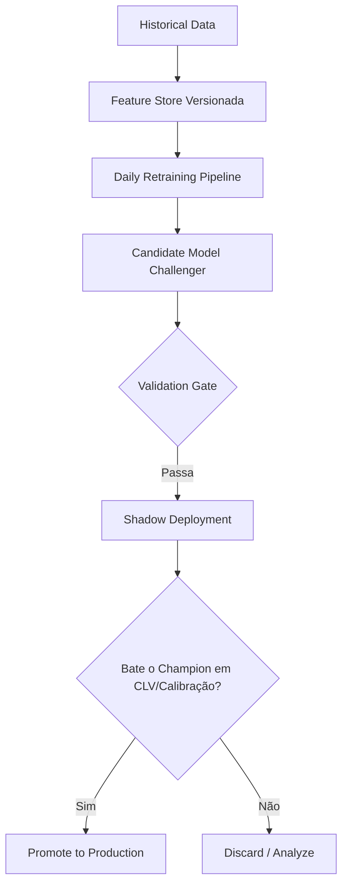

# 🔄 MLOps e Retreinamento Contínuo

**Componente:** MLOps & Machine Learning  
**Status:** 🚧 Em desenvolvimento  
**Responsável:** Principal Quant Engineer & ML Engineer  
**Última atualização:** 2026-05-19

---

## 🎯 Objetivo

Eliminar o erro clássico de "Train once → Deploy forever". Garantir que o sistema VBQ-UNIFIED deteta e adapta-se a *concept drift* em desportos (mudanças de meta, regras, lesões e táticas) através de pipelines de retreinamento contínuo e promoção agressiva através do sistema *Champion vs Challenger*.

---

## 🏗️ 1. Estratégia de Retreinamento Híbrido

O sistema tem de balancear a **adaptação a curto prazo** e a **robustez a longo prazo**.

### NBA & Futebol (Ligas Contínuas)
- **Long-term Memory (Robustez):** Expanding window com o histórico total da liga (ex: 2018 até ao presente), aplicando *temporal decay* (pesos menores em jogos antigos).
- **Short-term Memory (Adaptação):** Rolling window dos últimos 12 a 18 meses.
- **Frequência de Retrain:**
  - **Diário:** Features de odds e mercado.
  - **Semanal/Pós-Jornada:** Modelo principal (XGBoost/LightGBM).

### UFC & MMA (Desportos Episódicos)
- **Como há menos dados estruturados:**
  - Janela de expanding muito maior.
  - *Decay temporal* agressivo (o meta de MMA evolui muito rápido).
  - Retrain após cada evento numerado (UFC PPV) ou Fight Night.

---

## 🏃 2. Walk-Forward Retraining (Obrigatório)

O Gold Standard em modelação de apostas desportivas. Não usamos *Train/Test splits* aleatórios nem estáticos, o que causaria **temporal leakage**.

### Algoritmo:
1. **Train:** 2018 até Jan 2023 → **Predict:** Fev 2023
2. **Train:** 2018 até Fev 2023 → **Predict:** Mar 2023
3. E assim sucessivamente (expanding window).

Isto garante que as métricas calculadas em backtest refletem o que aconteceria num cenário real de produção.

---

## 🏆 3. Champion vs Challenger System

Nunca devemos usar e confiar apenas num modelo cego. O sistema corre dois modelos em paralelo no pipeline de *shadow deployment*.

### Champion (Live)
- O modelo atual que emite os sinais para o Telegram.

### Challenger (Novo Candidato)
- Modelo que surge após o último ciclo de retraining ou de uma nova experiência da *Hypothesis Engine*.

### Gate de Promoção
O Challenger só substitui o Champion se vencer consistentemente numa checklist exaustiva:
1. **CLV (Closed Line Value):** A métrica primordial. Se o Champion gera +2.7% CLV e o Challenger -0.4% CLV, o Challenger é rejeitado mesmo que tenha tido um ROI superior por sorte no curto prazo.
2. **Brier Score / Calibration.**
3. **Drawdown / Stability.**

---

## 🧱 4. Pipeline de MLOps

---

## 📝 Próximos Passos

- Implementar `src/mlops/walk_forward.py` e `src/mlops/rolling_retrain.py`.
- Ligar os scripts ao **Model Registry** (MLflow).
- Desenvolver a interface visual ou de log do *Champion vs Challenger*.

---

## 🔗 Links Relacionados

- [[Machine Learning]] - Arquitetura dos Modelos Preditivos Base
- [[Validação e Calibração]] - Verificação Contínua
- [[Arquitetura de Experimentação]] - Feature Store e Experiências
