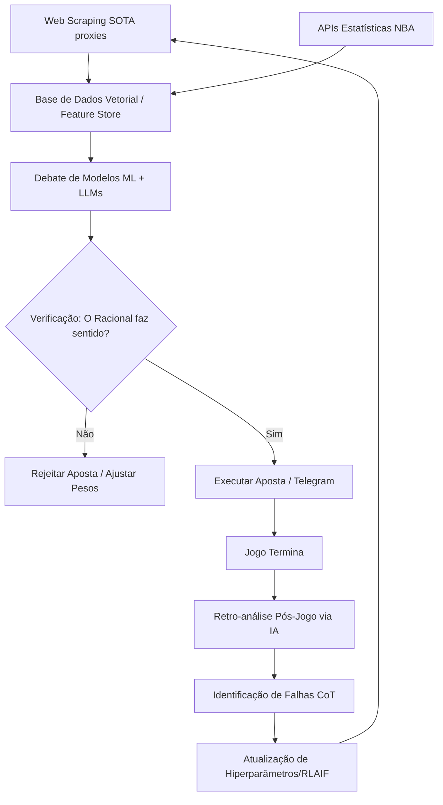

# 🌐 Pesquisa Avançada e Validação

**Componente:** Machine Learning & Data Ops
**Status:** 🚧 Pesquisa / Planeamento
**Responsável:** AI Research Lead & Quant Engineer
**Última atualização:** 2026-05-19

---

## 🎯 Objetivo

Implementar as **melhores técnicas do mundo para pesquisa na rede (web scraping, crawlers, APIs)**, enriquecer os dados do modelo através de **RAG (Retrieval-Augmented Generation)**, e garantir o **estudo e validação automática de respostas (Self-Reflection e RLAIF)** para que o sistema de apostas desportivas possa "estudar" e confirmar continuamente se suas previsões estão corretas.

Esta arquitetura transforma o bot de apostas numa IA com capacidade de autocrítica, busca contínua por informações e evolução orgânica.

---

## 🕷️ 1. Técnicas de Pesquisa na Rede (Web Research SOTA)

Para construir um modelo imbatível, precisamos capturar informação mais rápido e com mais precisão do que os mercados.

### 1.1 RAG (Retrieval-Augmented Generation) para Apostas
A capacidade de um LLM ou modelo supervisionado aceder a informações atualizadas da web no exato momento da previsão.
- **Como Funciona:** Em vez de usar apenas estatísticas estáticas, o modelo pesquisa no Twitter/X, Reddit, e sites de notícias por "Breaking News" (lesões de última hora, conflitos no balneário).
- **Vetorização:** Armazenamento em bases de dados vetoriais (ex: Pinecone, Qdrant) para procura semântica super-rápida.
- **Impacto no Bot:** Reduz erros grosseiros em jogos onde a estrela da equipa fica de fora a 5 minutos do início.

### 1.2 Web Scraping Avançado e Evasão (Stealth Crawling)
Técnicas de topo de gama para contornar proteções anti-bot (Cloudflare, Datadome).
- **Puppeteer Extra com Stealth Plugin:** Automação de browser invisível aos sistemas de segurança.
- **Redes de Proxies Residenciais Rotativos:** Usar IPs residenciais e Mobile 4G/5G (Bright Data, Oxylabs) para simular tráfego humano realista.
- **Bypass de CAPTCHAs via IA:** Integração com serviços de resolução baseados em Machine Learning e Human-in-the-loop (2Captcha, CapSolver).
- **Extração via LLM (Zero-Shot Extraction):** Em vez de XPath quebradiço, enviar o HTML bruto para um LLM extrair o JSON de odds, estatísticas ou lesões perfeitamente estruturado.

---

## 🧠 2. Treinamento e Evolução do Modelo

As abordagens mais modernas para garantir que o modelo nunca estagna e adapta-se a mudanças no meta (mudanças de regras, estilo de jogo).

### 2.1 RLHF (Reinforcement Learning from Human Feedback)
Evolução através de feedback.
- O modelo faz predições. Analistas quantitativos (ou utilizadores Alpha) dão *thumbs up/down* à lógica subjacente.
- É treinado um *Reward Model* que passa a penalizar o modelo de apostas quando a lógica ou o risco assumido for irresponsável, mesmo que a aposta acerte por sorte.

### 2.2 RLAIF (Reinforcement Learning from AI Feedback)
Escalar o RLHF utilizando IAs maiores (ex: GPT-4 ou Claude 3 Opus) como "professores" ou avaliadores das apostas feitas pelos modelos menores do bot.
- **Processo:** O bot prevê Vitória da Equipa A. O modelo "Avaliador" lê as notícias, analisa os mesmos dados e valida se concorda com o racional (Processo Crítico > Resultado).

### 2.3 NAS (Neural Architecture Search) & Distributed Grid Search
A verdadeira "Pesquisa na Rede" para encontrar a melhor configuração de neurónios e hiperparâmetros de forma automática.
- Optuna distribuído através de clusters na Cloud.
- Otimização Bayesiana: Em vez de tentar todas as combinações, a IA foca-se apenas nos hiperparâmetros com maior probabilidade de gerar Edge (esperança matemática).

---

## 🔍 3. Estudo e Verificação de Respostas (Self-Correction)

Como o sistema estuda se a sua própria resposta está correta?

### 3.1 Chain-of-Thought (CoT) Prompting & Verification
Antes de devolver a odd e a probabilidade, o sistema deve "pensar em voz alta" numa camada oculta (logs):
1. Avaliar os dados históricos.
2. Analisar as notícias pesquisadas na rede em tempo real.
3. Cruzar com a movimentação das linhas (Smart Money).
4. Deduzir o resultado final.

### 3.2 O "Tribunal" de Modelos (Multi-Agent Debate)
Se uma aposta representa risco alto (stake grande), o sistema invoca 3 agentes LLM diferentes (ex: um Perito em Estatística, um Especialista em Lesões, um Analista de Sentimento).
- Os agentes debatem a aposta entre si.
- A aposta só é executada se houver consenso superior a 75% de probabilidade calculada.

### 3.3 Loop de Auto-Avaliação Pós-Jogo (Retro-análise Automatizada)
Onde a verdadeira aprendizagem acontece.
- **Análise Forense:** 24h após o jogo terminar, um pipeline automatizado corre para comparar a **Probabilidade Prevista** vs **Realidade do Jogo (Play-by-play)**.
- **Questionamento Socrático:** O sistema escreve um relatório autónomo (LLM) perguntando: *"A minha previsão falhou porquê? Foi variância (sorte/azar) ou o meu processo de pesquisa na rede falhou em detetar a lesão do jogador principal?"*
- **Ajuste de Pesos Automático:** Se for provado que a pesquisa de notícias falhou, o modelo dá imediatamente mais peso a sinais vitais em tempo real nos próximos treinos.

---

## 🛠️ Pipeline Proposto (Arquitetura)

---

## 📝 Próximos Passos de Implementação

1. **Crawler Silencioso:** Integrar o Puppeteer Stealth + Bright Data na camada de [[Ingestão de Dados]].
2. **Motor de RAG:** Configurar a base vetorial (Qdrant) para armazenar tweets e notícias do dia relacionadas com as equipas que vão jogar.
3. **Loop de Avaliação:** Implementar o script pós-jogo que utiliza o log de previsões e usa um LLM para criticar as perdas (Erro do modelo vs Variância).
4. **Atualizar Modelo Base:** Conectar a saída qualitativa do RAG como *Embeddings* nos modelos XGBoost/LightGBM da camada de [[Machine Learning]].

---

## 🔗 Links Relacionados

- [[Machine Learning]] - Integração dos Embeddings RAG e RLHF
- [[Ingestão de Dados]] - Pipelines de Web Scraping e Proxies
- [[Motor de Edge]] - Uso da verificação de respostas para confirmar o Edge

---
**Status:** 🚧 Integração na Fase 3 do Roadmap.
