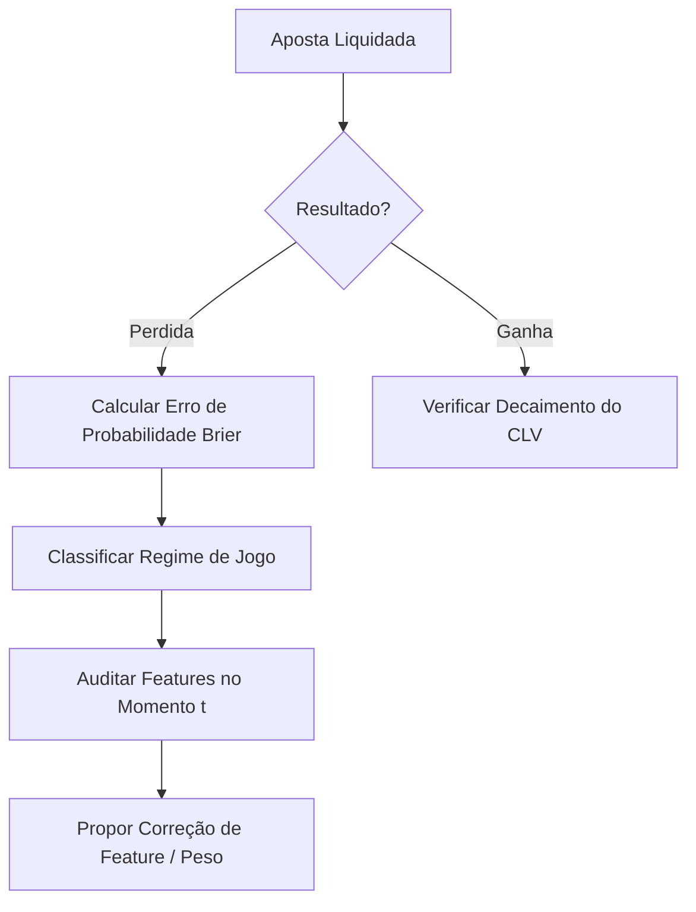

# Protocolo de Análise Post-Mortem de Apostas (Dados até 2025)

**Versão:** 1.0.0  
**Status:** #status/active #priority/critical  
**Área:** Quant Research / MLOps

---

## 🎯 OBJETIVO
Definir o processo quantitativo de auditoria de resultados históricos acumulados (até 2025) para identificar de forma sistemática por que determinadas apostas de valor recomendadas pelo modelo resultaram em perda, refinando o conjunto de features e mitigando vieses cognitivos ou estatísticos.

---

## 🔄 FLUXO DE TRABALHO DO DIAGNÓSTICO RETROSPECTIVO

### 1. Triagem e Cálculo do Erro de Probabilidade
Para cada jogo no dataset de backtest (2020-2025), calculamos a perda quadrática individual (Brier Score do jogo):
$$\text{Brier}_i = (P_{\text{calibrada}} - Y_i)^2$$
onde $Y_i = 1$ se a equipe apostada venceu, e $0$ se perdeu.

- **Foco de Auditoria:** Jogos com $\text{Brier}_i > 0.40$ (erros graves de predição onde o modelo atribuía alta probabilidade à equipe derrotada).

### 2. Classificação de Regimes de Erro
Categorizar as perdas graves de acordo com os seguintes metadados de contexto:
- **Regime de Descanso:** Back-to-back (B2B), viagem longa (>1000 milhas terrestres), diferença de descanso em relação ao oponente.
- **Regime de Mercado:** Flutuação extrema de odds (linha abriu em 1.90 e fechou em 2.20).
- **Regime de Alinhamento:** Lesões de última hora não capturadas no ELO clássico.

### 3. Ajuste Estatístico e Iteração do Pipeline de Features
Caso um padrão de erro seja detectado em determinado regime (ex: o modelo sobreestima favoritos fora de casa em situações de B2B):
1. **Adicionar feature de interação:** `b2b_away * elo_diff`.
2. **Aplicar penalização no ELO:** Implementar decaimento dinâmico de ELO para plantéis em viagens longas consecutivas.
3. **Calibração por Segmento:** Executar calibração isotônica segregada para jogos de temporada regular vs playoffs.

---

## 📋 CHECKLIST DE REVISÃO RETROATIVA
- [ ] Listar as 50 maiores perdas financeiras simuladas ou reais de 2024-2025.
- [ ] Cruzar com os relatórios de lesões oficiais da NBA no dia do jogo.
- [ ] Verificar se as odds do bookmaker fecharam em direção contrária à aposta (indicando decaimento negativo de CLV).
- [ ] Atualizar o vetor de pesos SHAP para garantir que as features responsáveis pelo erro foram devidamente tratadas.
