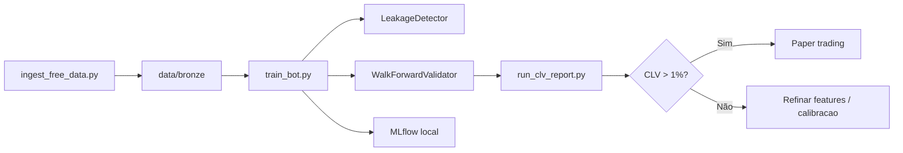

# Stack Profissional — Custo 0€

## Princípio

| Camada | Opção 0€ | Opção paga (evitar até validar CLV) |
|--------|----------|-------------------------------------|
| Dados | mock + football_real_odds + football-data.org + nba_api | OddsAPI paid tier |
| Storage | Parquet em `data/` | S3, BigQuery |
| DB | Opcional Postgres Docker local | RDS |
| MLOps | MLflow `./mlruns` | Databricks |
| Orquestração | `scripts/train_bot.py` + Cursor Automation | Prefect Cloud |
| Observabilidade | JSON reports em `data/reports/` | Grafana Cloud |
| Execução | Paper trading / logs | Betfair live |

## Fluxo de treino recomendado



## Checklist profissional (0€)

- [ ] `ingest_free_data.py --source mock` executado
- [ ] `ingest_free_data.py --source football-data-co-uk` executado
- [ ] `train_bot.py football --source football_real_odds --walk-forward` sem leakage warnings
- [ ] `run_clv_report.py --source real` com CLV real medido em `football_real_odds`
- [ ] `edge_proven: true` só depois de validar dados reais, não mock
- [ ] Token football-data.org configurado para ligas reais
- [ ] 81+ testes pytest a passar
- [ ] `.env` nunca commitado

## Quando passar de 0€ para mínimo custo

1. **OddsAPI** — só após CLV positivo em histórico gratuito/SBR scrape  
2. **VPS** — só para cron 24/7 (~5€/mês)  
3. **Betfair** — sandbox grátis primeiro  

## Comandos diários (cron / Cursor Automation)

```powershell
poetry run python scripts/ingest_free_data.py --sport football --source football-data
poetry run python scripts/train_bot.py football --walk-forward
poetry run python scripts/run_clv_report.py
```
